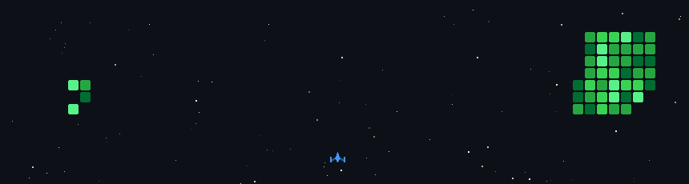

# 📟 Maximiliano Rodriguez | Electronics, Cybersecurity & Design

### 📌 About Me
I am a passionate developer focused on **hardware description languages**, **embedded systems**, **cybersecurity**, and **3D design**. Currently, I am exploring the performance limits of FPGAs, functional 3D modeling, and key fundamentals of information security.
---

### 💻 Tech Stack
 Languages
 

---
Software

---
### 🕹️ INSERT COMMITS TO PLAY

---

### 📬 Stay in touch

  
  

